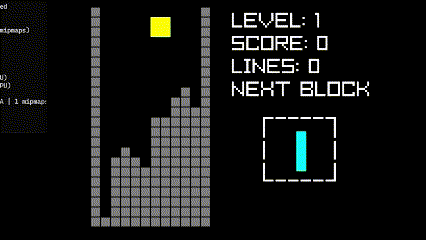
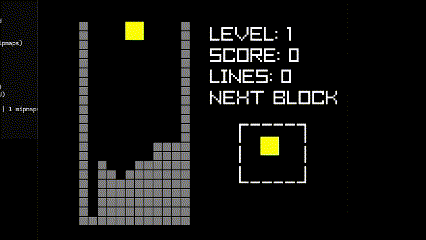
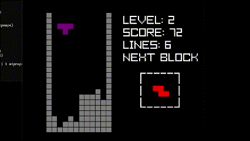
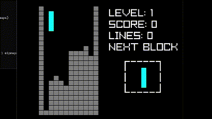
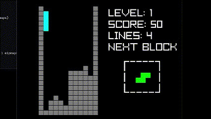

# Tetris
In Tetris, the objective is to manipulate falling geometric shapes (known as "Tetrominoes") within a confined grid to form complete horizontal lines. Each completed line clears from the grid, increasing the score and allowing new pieces to fall. The game ends when the grid fills up, leaving no space for new pieces.



## Game Controls
**Arrow Left/Right:** Moves the Tetromino left or right.



**Space:** Rotates the Tetromino clockwise (or counterclockwise, depending on your implementation).



**Arrow Down:** Soft Drop increases the fall speed of the Tetromino, bringing it closer to the bottom.



**Arrow Up:** Hard Drop instantly drops the Tetromino to the bottom of the grid.



## Line Clearing Process
When a Tetromino completes a horizontal line within the grid, that line clears, and all rows above it shift down by one row. Multiple lines cleared at once yield higher scores.

## Code:


### Tetris.c
The entry point for the game. Initializes the game, manages the game loop, and handles key events.
```c
//clang.exe -o Tetris.exe Tetris.c CheckCollision.c Audio.c Inputs.c DrawInterface.c -l raylibdll -I include

#include "Tetris.h"


int stage[] = // rappresentation of the stage
{
    1,0,0,0,0,0,0,0,0,0,0,1,
    1,0,0,0,0,0,0,0,0,0,0,1,
    1,0,0,0,0,0,0,0,0,0,0,1,
    1,0,0,0,0,0,0,0,0,0,0,1,
    1,0,0,0,0,0,0,0,0,0,0,1,
    1,0,0,0,0,0,0,0,0,0,0,1,
    1,0,0,0,0,0,0,0,0,0,0,1,
    1,0,0,0,0,0,0,0,0,0,0,1,
    1,0,0,0,0,0,0,0,0,0,0,1,
    1,0,0,0,0,0,0,0,0,0,0,1,
    1,0,0,0,0,0,0,0,0,0,0,1,
    1,0,0,0,0,0,0,0,0,0,0,1,
    1,0,0,0,0,0,0,0,0,0,0,1,
    1,0,0,0,0,0,0,0,0,0,0,1,
    1,0,0,0,0,0,0,0,0,0,0,1,
    1,0,0,0,0,0,0,0,0,0,0,1,
    1,0,0,0,0,0,0,0,0,0,0,1,
    1,0,0,0,0,0,0,0,0,0,0,1,
    1,0,0,0,0,0,0,0,0,0,0,1,
    1,0,0,0,0,0,0,0,0,0,0,1,
    1,0,0,0,0,0,0,0,0,0,0,1,
    1,1,1,1,1,1,1,1,1,1,1,1,
};
//block representation, some blocks do not require all rotation
const int lTetromino0[] = 
{
    0,1,0,0,
    0,1,0,0,
    0,1,1,0,
    0,0,0,0,
};

const int lTetromino90[] =
{
    0,0,0,0,
    1,1,1,0,
    1,0,0,0,
    0,0,0,0,
};

const int lTetromino180[] =
{
    1,1,0,0,
    0,1,0,0,
    0,1,0,0,
    0,0,0,0,
};

const int lTetromino270[] =
{
    0,0,1,0,
    1,1,1,0,
    0,0,0,0,
    0,0,0,0,
};

const int jTetromino0[] =
{
    0,1,0,0,
    0,1,0,0,
    1,1,0,0,
    0,0,0,0,
};

const int jTetromino90[] =
 {
    1,0,0,0,
    1,1,1,0,
    0,0,0,0,
    0,0,0,0,
};

const int jTetromino180[] =
{
    0,1,1,0,
    0,1,0,0,
    0,1,0,0,
    0,0,0,0,
};

const int jTetromino270[] =
{
    0,0,0,0,
    1,1,1,0,
    0,0,1,0,
    0,0,0,0,
};

const int oTetromino[] =
{
    1,1,0,0,
    1,1,0,0,
    0,0,0,0,
    0,0,0,0,
};

const int sTetromino0[] =
{
    0,0,0,0,
    0,1,1,0,
    1,1,0,0,
    0,0,0,0,
};

const int sTetromino90[] =
{
    1,0,0,0,
    1,1,0,0,
    0,1,0,0,
    0,0,0,0,
};

const int tTetromino0[] =
{
    0,0,0,0,
    1,1,1,0,
    0,1,0,0,
    0,0,0,0,
};

const int tTetromino90[] =
{
    0,1,0,0,
    1,1,0,0,
    0,1,0,0,
    0,0,0,0,
};

const int tTetromino180[] =
{
    0,1,0,0,
    1,1,1,0,
    0,0,0,0,
    0,0,0,0,
};

const int tTetromino270[] =
{
    0,1,0,0,
    0,1,1,0,
    0,1,0,0,
    0,0,0,0,
};

const int iTetromino0[] =
{
    0,1,0,0,
    0,1,0,0,
    0,1,0,0,
    0,1,0,0,
};

const int iTetromino90[] =
{
    0,0,0,0,
    1,1,1,1,
    0,0,0,0,
    0,0,0,0,
};

const int zTetromino0[] =
{
    0,0,0,0,
    1,1,0,0,
    0,1,1,0,
    0,0,0,0,
};

const int zTetromino90[] =
{
    0,1,0,0,
    1,1,0,0,
    1,0,0,0,
    0,0,0,0,
};
const Color colorTypes[8] =
{
    {255, 0, 0, 255}, //red
    {0, 255, 0, 255}, //green
    {128, 0, 128, 255}, //purple
    {255, 255, 0, 255}, //yellow
    {0, 255, 255, 255}, //cyan
    {0, 0, 255, 255}, //blue
    {255, 127, 0, 255}, //orange
    {127, 127, 127, 255}, // grey
};


const int *tetrominoTypes[7][4] = //array with all the tetromini and rotation
{
    {zTetromino0, zTetromino90, zTetromino0, zTetromino90},
    {sTetromino0, sTetromino90, sTetromino0, sTetromino90},
    {tTetromino0, tTetromino90, tTetromino180, tTetromino270},
    {oTetromino, oTetromino, oTetromino, oTetromino},
    {iTetromino0, iTetromino90, iTetromino0, iTetromino90},
    {jTetromino0, jTetromino90, jTetromino180, jTetromino270},
    {lTetromino0, lTetromino90, lTetromino180, lTetromino270},
};

//draw the tetromino
void DrawTetromino(const Color currentColor, const int startOffsetX, const int startOffsetY, const int tetrominoStartX, const int tetrominoStartY, const int *tetromino)
{
    for (int y = 0; y < TETROMINO_SIZE; y++)
    {
        for (int x = 0; x < TETROMINO_SIZE; x++)
        {
            const int offset = y * TETROMINO_SIZE + x;

            if (tetromino[offset] == 1)
            {
                DrawRectangle((x + tetrominoStartX) * TILE_SIZE + startOffsetX, (y + tetrominoStartY) * TILE_SIZE + startOffsetY, TILE_SIZE, TILE_SIZE, currentColor);
            }
        }
    }
}
//draw the next tetromino
void DrawNextTetromino(const Color currentColor, const int tetrominoStartX, const int tetrominoStartY, const int *tetromino)
{
    for (int y = 0; y < TETROMINO_SIZE; y++)
    {
        for (int x = 0; x < TETROMINO_SIZE; x++)
        {
            const int offset = y * TETROMINO_SIZE + x;

            if (tetromino[offset] == 1)
            {
                DrawRectangle((x + tetrominoStartX) * TILE_SIZE, (y + tetrominoStartY) * TILE_SIZE, TILE_SIZE, TILE_SIZE, currentColor);
            }
        }
    }
}

//draw the stage
void DrawBackgrond(const int startOffsetX,const  int startOffsetY)
{
    for (int y = 0; y < STAGE_HEIGHT; y++)
    {
        for (int x = 0; x < STAGE_WIDTH; x++)
        {
            const int offset = y * STAGE_WIDTH + x;
            const int color = stage[offset];
            if (stage[offset] != 0) // if the stage[] value is 1 we draw a grey square, to form the tetris arena, otherwise we draw a black square
            {
                DrawRectangle(x * TILE_SIZE + startOffsetX, y * TILE_SIZE + startOffsetY, TILE_SIZE, TILE_SIZE, colorTypes[BACKGROUNDCOLOR]);
            }

            DrawRectangleLines(x * TILE_SIZE + startOffsetX, y * TILE_SIZE + startOffsetY, TILE_SIZE, TILE_SIZE, BLACK);
        }
    }
}


void ResetLines(const int startLineY) // when we clear a line, we need to lower the other blocks
{
    for (int y = startLineY; y >= 0; y--)
    {
        for (int x = 1; x < STAGE_WIDTH - 1; x++)
        {
            const int offset = y * STAGE_WIDTH + x; // current block
            const int offset_below = (y + 1) * STAGE_WIDTH + x; // block below the current block
            if (stage[offset_below] == 0 && stage[offset] > 0)//if the block under the current block is empty we lower the block
            {
                stage[offset_below] = stage[offset];
                stage[offset] = 0;
            }
        }
    }
}

void DeleteLines(const Sound sound, float *score, int *lines, float *timer)//when we delete a line, we have to delete it
{
    float scoreMultiplier = 1; // used to mulpitly the score when we clear more line in one
    for (int y = 0; y < STAGE_HEIGHT - 1; y++)
    {
        int checkLine = 1; // used to see if we have a entire line of 1
        for (int x = 1; x < STAGE_WIDTH - 1; x++)
        {
            const int offset = y * STAGE_WIDTH + x;
            if (stage[offset] == 0) 
            {
                checkLine = 0;
                break;
            }
        }
        if (checkLine)//when we find a line of ones we update the score, we increase the velocity of the tetromino
        {
            const int offset = y * STAGE_WIDTH + 1;
            memset(stage + offset, 0, (STAGE_WIDTH - 2) * sizeof(int));//we convert all the ones in zeros
            DrawRectangle(0, 0, GetScreenWidth(), GetScreenHeight(), Fade(RED, 0.75f)); // we create a visual effect to see that we clear a line
            PlaySound(sound); // we play the clear effect
            ResetLines(y);//we lower the other blocks
            *lines += 1; // we add 1 for all deleted lines
            *timer -= 0.02; // we increase the velocity of the tetrominor 
            scoreMultiplier += 0.1; // we increate the score multiplier
            *score += 10 * scoreMultiplier; // we calculate the score
        }
    }
}

int CheckCollisionAtSpawn(const int tetrominoStartX, const int tetrominoStartY, const int tetrominoType,const int rotation) // check for collision when we create a new tetromino, return 1 if we have collision otherwise return 0
{
    const int *tetromino = tetrominoTypes[tetrominoType][rotation]; // we get the pointer of the new tetromino

    for (int y = 0; y < TETROMINO_SIZE; y++) //we scroll through the matrix
    {
        for (int x = 0; x < TETROMINO_SIZE; x++)
        {
            const int offset = y * TETROMINO_SIZE + x;

            if (tetromino[offset] == 1) //when we find 1 we check if the is another 1 in the stage at the same position
            {
                const int offsetX = x + tetrominoStartX;
                const int offsetY = y + tetrominoStartY;

                if (stage[offsetY * STAGE_WIDTH + offsetX] != 0)
                {
                    return 1; // if we have a collision we return a 1, that mean it's game over
                }
            }
        }
    }
    return 0; 
}

void ClearStage() // clean the stage
{
    for (int y = 0; y < STAGE_HEIGHT; y++)
    {
        for (int x = 0; x < STAGE_WIDTH; x++)
        {
            const int offset = y * STAGE_WIDTH + x;
            if (x == 0 || x == STAGE_WIDTH - 1 || y == STAGE_HEIGHT - 1)
                stage[offset] = 1;
            else
                stage[offset] = 0;
        }
    }
}


int main(int argc, char **argv, char **environ)
{
    Sound soundEffect; //clear sound
    Sound gameOverEffect; //gameover sound
    Music music; //music
    InitAudio(&soundEffect, &music, &gameOverEffect); 
    int lines = 0; //lines cleaned
    bool gameOver = false; //become true when the player lose
    float score = 0; //player score
    const int windowWidth = 800; //window width
    const int windowHeight = 700; //window height
    const int startOffsetX = (windowWidth / 2) - ((STAGE_WIDTH * TILE_SIZE) / 2) - 150; // starting point for drawing the arena
    const int startOffsetY = (windowHeight / 2) - ((STAGE_HEIGHT * TILE_SIZE) / 2);
    const int tetrominoStartX = STAGE_WIDTH / 2 - 1; //tetromino X spawning point 
    const int tetrominoStartY = 0; //tetromino Y spawning point 
    bool CheckCleanLine; // true if we drop a tetromino and we need to check if we have completed a line
    int currentTetrominoX = tetrominoStartX;
    int currentTetrominoY = tetrominoStartY;

    time_t unixTime; // number of second since 00:00, Jan 1 1970
    time(&unixTime); 
    SetRandomSeed(unixTime); //set the seed for the number generator

    int currentTetrominoType = GetRandomValue(0, 6); //generate aa tetromino
    int futureTetrominoType = GetRandomValue(0, 6); // generate the future tetromino
    int currentRotation = 0; //rotation of the tetromino

    float moveTetrominoDownTimer = 1.f; //when this timer turn to 0 the tetromino move down
    float timeToMoveTetrominoDown = moveTetrominoDownTimer;

    InitWindow(windowWidth, windowHeight, "TETRIS"); //used  for create the the window

    SetTargetFPS(60); //FPS target
    PlayMusicStream(music); //start the music
    SetMusicVolume(music, 0.25); //set the volume
    while (!WindowShouldClose())
    {
        if (!gameOver) //if the player lose he can't do anything
        {
            timeToMoveTetrominoDown -= GetFrameTime(); // subtract the frame from the timer
            CheckCleanLine = false;
            //player controls
            CheckCleanLine = Inputs(&currentRotation,&currentTetrominoX,&currentTetrominoY,currentTetrominoType,&timeToMoveTetrominoDown,moveTetrominoDownTimer,tetrominoTypes);
            if(CheckCleanLine)
            {
                DeleteLines(soundEffect, &score, &lines, &moveTetrominoDownTimer); //check if we have completed a line
                //we create a new tetromino
                currentTetrominoX = tetrominoStartX;
                currentTetrominoY = tetrominoStartY;
                currentTetrominoType = futureTetrominoType; 
                futureTetrominoType = GetRandomValue(0, 6); // set a new future tetromino
                currentRotation = 0;
                CheckCleanLine=false;
            }
        }
        BeginDrawing();
        if (CheckCollisionAtSpawn(tetrominoStartX, tetrominoStartY, currentTetrominoType, currentRotation))//check if we have a collision at the start, if we have a collision the player lose
        {

            if (!gameOver) // used for play the gameover effect a single time
            {
                gameOver = true;
                StopMusicStream(music);
                PlaySound(gameOverEffect);
            }

            DrawGameover(score);

            if (IsKeyPressed(KEY_R))//if the player press r the game restart
            {
                lines = 0;
                score = 0;
                moveTetrominoDownTimer = 1.f;
                timeToMoveTetrominoDown = moveTetrominoDownTimer;

                gameOver = false;
                ClearStage();
                PlayMusicStream(music);
            }
        }
        else
        {
            //draw the game
            ClearBackground(BLACK);
            DrawBackgrond(startOffsetX, startOffsetY);
            DrawTetromino(colorTypes[currentTetrominoType], startOffsetX, startOffsetY, currentTetrominoX, currentTetrominoY, tetrominoTypes[currentTetrominoType][currentRotation]);
            DrawNextTetromino(colorTypes[futureTetrominoType], FUTUREBLOCKX, FUTUREBLOCKY, tetrominoTypes[futureTetrominoType][0]);
            DrawHUD(score, lines, moveTetrominoDownTimer);
        }
        UpdateMusicStream(music);
        EndDrawing();
    }
    return 0;
}

```
##
### Tetris.h
```c
#include "raylib.h"
#include <time.h>
#include <string.h>
#include <stdio.h>
#include <stdbool.h>
#define STAGE_WIDTH 12
#define STAGE_HEIGHT 22
#define TILE_SIZE 24
#define TETROMINO_SIZE 4
#define BACKGROUNDCOLOR 7
#define HUDPOSITION 150 
#define FUTUREBLOCKX 24 
#define FUTUREBLOCKY 16
int CheckCollision(const int tetrominoStartX, const int tetrominoStartY, const int *tetromino);
void InitAudio(Sound *soundEffect, Music *music, Sound *gameOverEffect);
bool Inputs(int* currentRotation, int* currentTetrominoX, int* currentTetrominoY, const int currentTetrominoType, float* timeToMoveTetrominoDown, const float moveTetrominoDownTimer ,const int* tetrominoTypes[][4]);
void DrawHUD(const int score, const int lines, const float moveTetrominoDownTimer);
void DrawGameover(const int score);

```
##
### CheckColision.c
Manages the game's line-clearing logic
```c
#include "Tetris.h"

extern int stage[];

int CheckCollision(const int tetrominoStartX, const int tetrominoStartY, const int *tetromino)
{
    for(int y = 0; y < TETROMINO_SIZE; y++)
    {
        for(int x = 0; x < TETROMINO_SIZE; x++)
        {
            const int offset = y * TETROMINO_SIZE + x;

            if(tetromino[offset] == 1)
            {
                const int offset_stage = (y + tetrominoStartY) * STAGE_WIDTH + (x +tetrominoStartX);

                if (stage[offset_stage] != 0)
                {
                    return 1;
                }
            }
        }
    }

    return 0;
}
```
##
### Audio
Handles the Audio
```c
#include "Tetris.h"

void InitAudio(Sound *soundEffect, Music *music, Sound *gameOverEffect) //initializes wav files
{
    InitAudioDevice();//initializes audio device
    *gameOverEffect = LoadSound("sound/GameOver.wav");
    *soundEffect = LoadSound("sound/lineClear.wav");
    *music = LoadMusicStream("sound/mainMusic.wav");
}
```
##
### DrawInterface.c
Manages the HUD
```c
#include "Tetris.h"
void DrawHUD(const int score, const int lines, const float moveTetrominoDownTimer) // allows to draw the HUD 
{
    int level = 11 - moveTetrominoDownTimer * 10; // we calculate the level, the lower is the timer the more high is the level
    DrawText(TextFormat("LEVEL: %d", level), 445, HUDPOSITION - 55, 50, WHITE);
    DrawText(TextFormat("SCORE: %d", score), 445, HUDPOSITION, 50, WHITE);
    DrawText(TextFormat("LINES: %d", lines), 445, HUDPOSITION + 55, 50, WHITE);
    DrawText(TextFormat("NEXT BLOCK"), 445, HUDPOSITION + 110, 50, WHITE);
    DrawText(TextFormat(" ______\n\n ______"), 500, HUDPOSITION + 165, 50, WHITE);
    DrawText(TextFormat(" |        |"), 500, HUDPOSITION + 205, 50, WHITE);
    DrawText(TextFormat(" |        |"), 500, HUDPOSITION + 257, 50, WHITE);
    DrawText(TextFormat(" |        |"), 500, HUDPOSITION + 310, 50, WHITE);
}

void DrawGameover(const int score)//draw the gameover and show the final score
{
    DrawRectangle(0, 0, GetScreenWidth(), GetScreenHeight(), Fade(BLACK, 1));
    DrawText("GAME OVER!", 265, 300, 50, RED);
    DrawText(TextFormat("SCORE: %d", score), 300, 350, 50, WHITE);
    DrawText("PRESS 'R' TO RESTART", 250, 400, 30, WHITE);
}
```
##
### Inputs.c 
Handles player input for piece movement, rotation, and speed control
```c
#include "Tetris.h"

// extern const int* tetrominoTypes[7][];
extern int stage[];


bool Inputs(int* currentRotation, int* currentTetrominoX, int* currentTetrominoY, const int currentTetrominoType, float* timeToMoveTetrominoDown, const float moveTetrominoDownTimer,const int* tetrominoTypes[][4])
{
    if (IsKeyPressed(KEY_SPACE)) // rotate the tetromino
    {
        const int lastRotation = (*currentRotation);
        (*currentRotation)++;
        if ((*currentRotation) > 3)
        {
            (*currentRotation) = 0;
        }
        if (CheckCollision((*currentTetrominoX), (*currentTetrominoY), tetrominoTypes[currentTetrominoType][(*currentRotation)]))
        {
            (*currentRotation) = lastRotation;
        }
    }
    if (IsKeyPressed(KEY_RIGHT)) // move tetromino rigth
    {
        if (!CheckCollision((*currentTetrominoX) + 1, (*currentTetrominoY), tetrominoTypes[currentTetrominoType][(*currentRotation)]))
        {
            (*currentTetrominoX)++;
        }
    }
    if (IsKeyPressed(KEY_LEFT)) // move tetromino left
    {
        if (!CheckCollision((*currentTetrominoX) - 1, (*currentTetrominoY), tetrominoTypes[currentTetrominoType][(*currentRotation)]))
        {
            (*currentTetrominoX)--;
        }
    }
    if (IsKeyPressed(KEY_UP)) // drop tetromino down
    {
        while (!CheckCollision((*currentTetrominoX), (*currentTetrominoY) + 1, tetrominoTypes[currentTetrominoType][(*currentRotation)]))
        {
            (*currentTetrominoY)++;
        }
        for (int y = 0; y < TETROMINO_SIZE; y++)
        {
            for (int x = 0; x < TETROMINO_SIZE; x++)
            {
                const int offset = y * TETROMINO_SIZE + x;

                const int *tetromino = tetrominoTypes[currentTetrominoType][(*currentRotation)];

                if (tetromino[offset] == 1)
                {
                    const int offset_stage = (y + (*currentTetrominoY)) * STAGE_WIDTH + (x + (*currentTetrominoX));
                    stage[offset_stage] = BACKGROUNDCOLOR;
                }
            }
        }
        
        return true;
    }
    if ((*timeToMoveTetrominoDown) <= 0 || IsKeyPressed(KEY_DOWN)) // move tetromino down
    {
        if (!CheckCollision((*currentTetrominoX), (*currentTetrominoY) + 1, tetrominoTypes[currentTetrominoType][(*currentRotation)]))
        {
            (*currentTetrominoY)++;
            (*timeToMoveTetrominoDown) = moveTetrominoDownTimer;
        }
        else
        {
            for (int y = 0; y < TETROMINO_SIZE; y++)
            {
                for (int x = 0; x < TETROMINO_SIZE; x++)
                {
                    const int offset = y * TETROMINO_SIZE + x;

                    const int *tetromino = tetrominoTypes[currentTetrominoType][(*currentRotation)];

                    if (tetromino[offset] == 1)
                    {
                        const int offset_stage = (y + (*currentTetrominoY)) * STAGE_WIDTH + (x + (*currentTetrominoX));
                        stage[offset_stage] = BACKGROUNDCOLOR;
                    }
                }
            }
            return true;
        }
    }
    return false;
}
```
